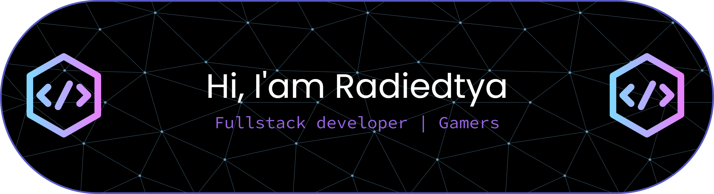

<h1 align="center">Hi 👋, I'm Radiedtya</h1>

  <b>Fullstack Web Developer</b> • <b>Laravel Specialist</b>

  

  

---

## 👨‍💻 About Me
- 🚀 Fullstack Developer focused on **Laravel-based solutions**
- 🧩 Enjoy solving problems with **clean and efficient code**
- 🏗 Building scalable systems, one feature at a time
- 🌙 Dark theme | ☕ Coffee | 🧠 Logic

---

## 🛠 Tech Stack

  

---

## 📊 GitHub Stats

  
  

---

## 🚀 Highlight Projects
- 🧱 **Laravel Admin Dashboard**
- 🔐 **Fullstack Web App** (Auth, CRUD, Roles & Permissions)
- ⚡ **RESTful API** with Laravel & MySQL

  <i>More projects coming soon…</i>

---

##  🤝 Connect With Me

  

